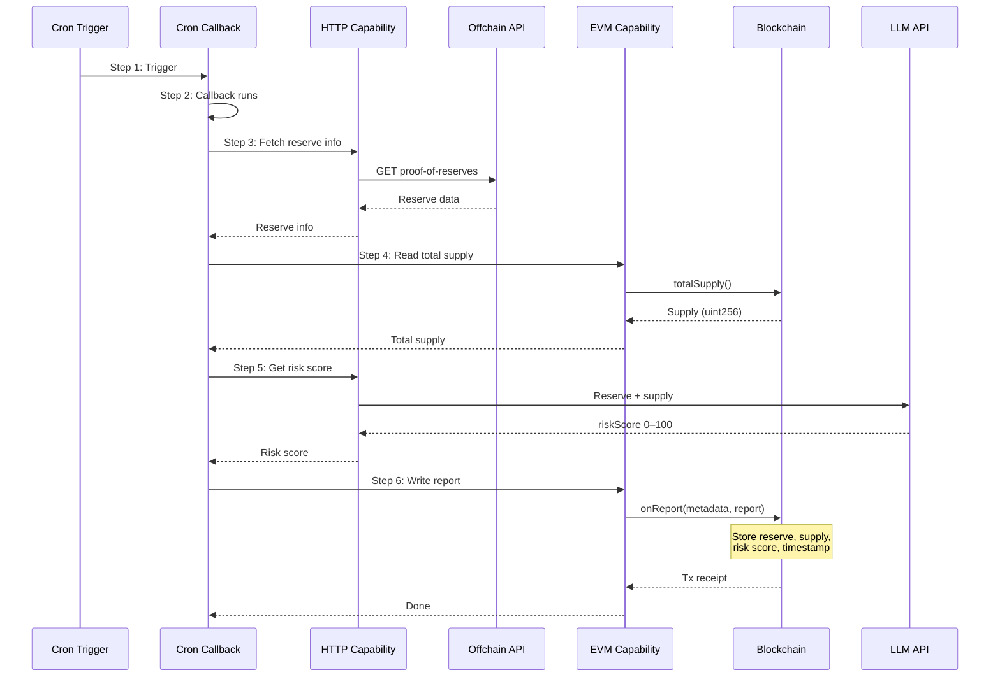

# ClearRate CCP Demo: End-to-End IRS Trading Flow

This document demonstrates how the ClearRate onchain Central Counterparty (CCP) for Interest Rate Swaps works through a complete trading lifecycle.

---

## Scenario: Alice and Bob Trade an IRS

**Setup:**
- **Alice** (account `ALICE_ACCOUNT`): Wants to pay **fixed** 5% and receive floating SOFR
- **Bob** (account `BOB_ACCOUNT`): Wants to receive fixed 5% and pay floating SOFR
- **Trade Terms:** $1M notional, 1-year tenor, quarterly payments, ACT/360 day-count

---

## Phase 1: Protocol Deployment & Initialization

First, the admin deploys all contracts and wires them together:

```solidity
// Deploy all core contracts
Whitelist whitelist = new Whitelist(admin);
GlobalMarginVault marginVault = new GlobalMarginVault(admin, tokens);
RiskEngine riskEngine = new RiskEngine(admin, address(marginVault), 9900, 7500);
YieldCurveOracle oracle = new YieldCurveOracle(admin, 1 days, tenors);
IRSInstrument instrument = new IRSInstrument(admin, "https://metadata.clearrate.io/{id}.json");
ClearingHouse clearingHouse = new ClearingHouse(
    admin,
    address(instrument),
    address(marginVault),
    address(riskEngine),
    address(whitelist),
    address(oracle)
);

// Grant roles
instrument.grantRole(CLEARING_HOUSE_ROLE, address(clearingHouse));
marginVault.grantRole(CLEARING_HOUSE_ROLE, address(clearingHouse));
riskEngine.grantRole(CLEARING_HOUSE_ROLE, address(clearingHouse));

// Set risk weights: 1-year tenor = 200 bps (2%)
riskEngine.setRiskWeight(365 days, 200);
```

**What happens:**
- `Whitelist` stores participant addresses mapped to account IDs
- `GlobalMarginVault` accepts USDC/USDT/DAI as collateral (1:1 valuation)
- `RiskEngine` configured with 99% confidence, 75% maintenance margin ratio
- `ClearingHouse` is the central coordinator with OPERATOR and SETTLEMENT roles

---

## Phase 2: Participant Onboarding

### Step 2.1: Add Participants to Whitelist

```solidity
// Admin adds Alice and Bob to the whitelist
whitelist.addParticipant(alice, keccak256("ALICE_ACCOUNT"));
whitelist.addParticipant(bob, keccak256("BOB_ACCOUNT"));
```

**What happens:**
- Alice and Bob are now whitelisted participants
- Each has a unique `accountId` (bytes32) used throughout the system
- The whitelist maps: `address → accountId` and `accountId → address`

### Step 2.2: Fund Margin Accounts

```solidity
// Alice deposits $500,000 USDC into her margin account
usdc.mint(alice, 500_000e6);
usdc.approve(address(marginVault), 500_000e6);
marginVault.depositMargin(ALICE_ACCOUNT, address(usdc), 500_000e6);

// Bob deposits $500,000 USDC
usdc.mint(bob, 500_000e6);
usdc.approve(address(marginVault), 500_000e6);
marginVault.depositMargin(BOB_ACCOUNT, address(usdc), 500_000e6);
```

**What happens in `GlobalMarginVault`:**

```
MarginAccount for ALICE_ACCOUNT:
├── totalCollateral: 500,000 USDC
├── lockedIM: 0 USDC
├── vmBalance: 0 USDC
└── exists: true
```

Both Alice and Bob now have **$500,000 free margin** available.

---

## Phase 3: Trade Agreement (Offchain)

Before submitting to the chain, Alice and Bob agree on trade terms offchain:

```javascript
const trade = {
    tradeId: keccak256("TRADE_001"),
    partyA: ALICE_ACCOUNT,           // Alice pays fixed
    partyB: BOB_ACCOUNT,             // Bob receives fixed
    notional: 1_000_000e6,          // $1M notional
    fixedRateBps: 500,               // 5.00% fixed rate
    startDate: block.timestamp,      // Today
    maturityDate: block.timestamp + 365 days,  // 1 year
    paymentInterval: 90 days,        // Quarterly
    dayCountConvention: 0,           // ACT/360
    floatingRateIndex: keccak256("SOFR"),
    nonce: 1,
    deadline: block.timestamp + 1 hour
};
```

Both parties sign the trade using **EIP-712** (typed data signing):

```javascript
// Alice signs the trade
const sigA = signEIP712(trade, alicePrivateKey);

// Bob signs the trade
const sigB = signEIP712(trade, bobPrivateKey);
```

---

## Phase 4: Trade Submission & Novation

An **operator** (or keeper) submits the matched trade to the ClearingHouse:

```solidity
// Operator submits the matched trade
vm.prank(operator);
clearingHouse.submitMatchedTrade(trade, sigA, sigB);
```

### What Happens Inside `submitMatchedTrade`:

#### 4.1 Validation
```solidity
// Check trade hasn't been submitted
if (tradeSubmitted[trade.tradeId]) revert TradeAlreadySubmitted();

// Check signatures are valid and from the right parties
_verifySignature(trade, trade.partyA, sigA);  // Alice signed
_verifySignature(trade, trade.partyB, sigB);  // Bob signed

// Check both parties are whitelisted
if (!whitelist.isWhitelisted(ownerA)) revert PartyNotWhitelisted();
if (!whitelist.isWhitelisted(ownerB)) revert PartyNotWhitelisted();
```

#### 4.2 Initial Margin Check
```solidity
// Calculate IM required for this trade
uint256 tenor = trade.maturityDate - trade.startDate;  // 365 days
uint256 imRequired = riskEngine.calculateIM(trade.notional, tenor);

// For $1M notional, 200 bps weight, 99% confidence:
// IM = 1,000,000 * 200 * 9900 / 10000^2 = $19,800

// Check both parties have sufficient free margin
if (!riskEngine.checkIM(trade.partyA, imRequired)) 
    revert InsufficientMarginForTrade();
if (!riskEngine.checkIM(trade.partyB, imRequired)) 
    revert InsufficientMarginForTrade();
```

#### 4.3 Novation - Mint Position Tokens

The CCP interposes itself between Alice and Bob. Two ERC-1155 tokens are minted:

```solidity
// Mint Alice's position (PAY_FIXED direction)
uint256 tokenIdA = instrument.mintPosition(alice, SwapTerms({
    notional: 1_000_000e6,
    fixedRateBps: 500,
    startDate: block.timestamp,
    maturityDate: block.timestamp + 365 days,
    paymentInterval: 90 days,
    direction: Direction.PAY_FIXED,
    floatingRateIndex: keccak256("SOFR"),
    dayCountConvention: 0
}));

// Mint Bob's position (RECEIVE_FIXED direction)
uint256 tokenIdB = instrument.mintPosition(bob, SwapTerms({
    notional: 1_000_000e6,
    fixedRateBps: 500,
    // ... same dates
    direction: Direction.RECEIVE_FIXED,
    // ...
}));
```

#### 4.4 Lock Initial Margin

```solidity
// Lock $19,800 IM for each party
marginVault.lockInitialMargin(ALICE_ACCOUNT, 19_800e6);
marginVault.lockInitialMargin(BOB_ACCOUNT, 19_800e6);
```

### Final State After Novation:

```
MarginAccount for ALICE_ACCOUNT:
├── totalCollateral: 500,000 USDC
├── lockedIM: 19,800 USDC        ← New position locked
├── freeMargin: 480,200 USDC     ← Available for new trades
└── vmBalance: 0

MarginAccount for BOB_ACCOUNT:
├── totalCollateral: 500,000 USDC
├── lockedIM: 19,800 USDC
├── freeMargin: 480,200 USDC
└── vmBalance: 0

Position (tradeId = "TRADE_001"):
├── tradeId: "TRADE_001"
├── partyA: ALICE_ACCOUNT (pays fixed)
├── partyB: BOB_ACCOUNT (receives fixed)
├── notional: 1,000,000 USDC
├── fixedRateBps: 500 (5%)
├── tokenIdA: 0 (Alice's ERC-1155)
├── tokenIdB: 1 (Bob's ERC-1155)
├── active: true
└── lastNpv: 0

ERC-1155 Tokens:
├── Alice owns tokenId 0: 1,000,000 (PAY_FIXED leg)
└── Bob owns tokenId 1: 1,000,000 (RECEIVE_FIXED leg)
```

---

## Phase 5: Mark-to-Market & Variation Margin

At end of Day 1, the CRE offchain workflow calculates NPV based on the yield curve:

```solidity
// Assume NPV calculation shows Alice (fixed payer) is "in the money"
// Fixed leg PV: $1M × 5% × 0.99 = $49,500
// Floating leg PV: $1M × 4.5% × 0.99 = $44,550
// NPV = $44,550 - $49,500 = -$4,950 (Alice loses, Bob gains)

// Settler calls with the new NPV
vm.prank(settler);
clearingHouse.settlePositionVM(tradeId, -4_950e6);
```

### What Happens:

```solidity
// In settlePositionVM:
int256 npvChange = newNpv - pos.lastNpv;  // -4,950 - 0 = -4,950
pos.lastNpv = newNpv;

// Alice (fixed payer) loses $4,950
marginVault.settleVariationMargin(ALICE_ACCOUNT, -4_950e6);

// Bob (fixed receiver) gains $4,950
marginVault.settleVariationMargin(BOB_ACCOUNT, 4_950e6);
```

### State After VM Settlement:

```
ALICE_ACCOUNT:
├── totalCollateral: 495,050 USDC  (500,000 - 4,950)
├── lockedIM: 19,800 USDC
└── freeMargin: 475,250 USDC

BOB_ACCOUNT:
├── totalCollateral: 504,950 USDC  (500,000 + 4,950)
├── lockedIM: 19,800 USDC
└── freeMargin: 485,150 USDC
```

---

## Phase 6: Position Compression

After some time, Alice and Bob enter an **offsetting trade** with the same notional:

```solidity
// Trade 2: Bob pays fixed to Alice (opposite direction)
// Bob is partyA (pays fixed), Alice is partyB (receives fixed)
// Same notional: $1M
clearingHouse.submitMatchedTrade(trade2, sigB_reverse, sigA_reverse);
```

Now Alice has:
- Position 1: PAY_FIXED (owes fixed, receives floating)
- Position 2: RECEIVE_FIXED (receives fixed, owes fixed)

### Compress the Positions

```solidity
// Operator calls compression to net out opposite positions
vm.prank(operator);
clearingHouse.compressPositions(tradeId1, tradeId2);
```

**What happens:**
- Both positions have the same notional ($1M) → fully offset
- Both positions are deactivated (`active = false`)
- IM is released back to both accounts

```
After Compression:
├── ALICE_ACCOUNT lockedIM: 0 USDC   (released)
├── BOB_ACCOUNT lockedIM: 0 USDC     (released)
├── Position 1: active = false, notional = 0
└── Position 2: active = false, notional = 0
```

---

## Phase 7: Position Maturity

If positions reach maturity without compression:

```solidity
// Warp to after maturity
vm.warp(block.timestamp + 365 days + 1);

// Settle the matured position
vm.prank(operator);
clearingHouse.settleMaturedPosition(tradeId);
```

**What happens:**
1. Position marked inactive
2. Locked IM released to both parties
3. ERC-1155 tokens burned

```
After Maturity Settlement:
├── ALICE_ACCOUNT lockedIM: 0 USDC (released)
├── BOB_ACCOUNT lockedIM: 0 USDC (released)
├── Position active: false
├── Alice's tokenId 0: burned (balance = 0)
└── Bob's tokenId 1: burned (balance = 0)
```

---

## Key Concepts Demonstrated

| Concept | How It Works |
|---------|-------------|
| **Novation** | CCP becomes counterparty to both sides; each gets ERC-1155 position token |
| **Initial Margin** | Locked upfront based on tenor risk weight; protects against future exposure |
| **Variation Margin** | Daily mark-to-market settlements; profits/losses transferred immediately |
| **Position Compression** | Offsetting positions net out; IM released, capital efficiency improved |
| **EIP-712 Signatures** | Gas-free trade agreement; onchain signature verification |
| **ERC-1155 Positions** | Each IRS leg is a tradable token with full swap terms in metadata |

---

## Risk Protection Flow

```
┌─────────────────────────────────────────────────────────────┐
│                    RISK MANAGEMENT                          │
├─────────────────────────────────────────────────────────────┤
│                                                             │
│  1. OPEN POSITION                                           │
│     └── checkIM() → must have enough free margin            │
│                                                             │
│  2. DURING LIFE                                             │
│     └── settleVM() → MTM gains/losses                       │
│     └── If totalCollateral < maintenanceMargin              │
│         └── isLiquidatable() = true                         │
│                                                             │
│  3. LIQUIDATION (if underwater)                             │
│     └── Liquidator can seize positions                      │
│     └── InsuranceFund covers deficit                        │
│                                                             │
│  4. MATURITY                                                │
│     └── IM released, tokens burned                          │
│     └── Final cash flow settlement                          │
│                                                             │
└─────────────────────────────────────────────────────────────┘
```

---

## Demo Summary

This demo showed:

1. **Setup**: Deploy contracts, onboard Alice & Bob, fund margin accounts
2. **Trade Agreement**: Offchain EIP-712 signed matched trade
3. **Novation**: CCP interposes, mints ERC-1155 tokens, locks IM
4. **VM Settlement**: Daily mark-to-market with real-time PnL
5. **Compression**: Offsetting positions net for capital efficiency
6. **Maturity**: Final settlement, IM release, token destruction

The system replicates traditional CCP clearinghouse functionality on-chain while leveraging:
- **Chainlink CRE** for yield curve bootstrapping and NPV calculation
- **Chainlink CCIP** for cross-chain margin synchronization
- **Stablecoins** as 1:1 collateral (no price feed haircuts)


